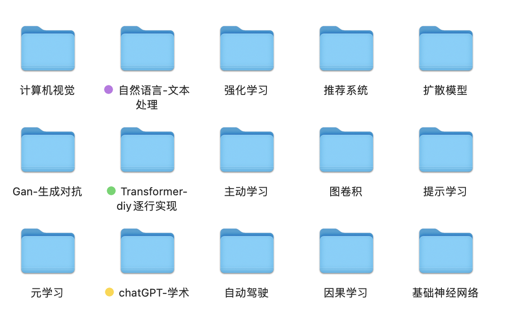
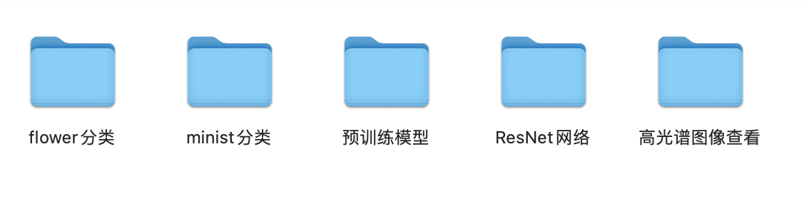
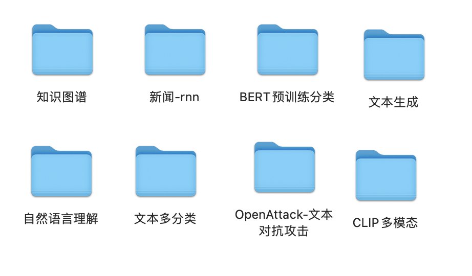
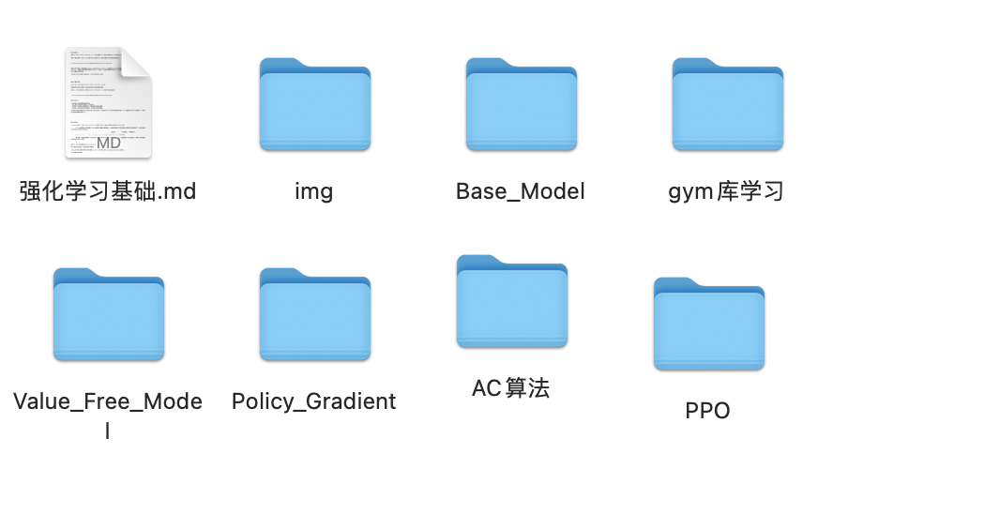
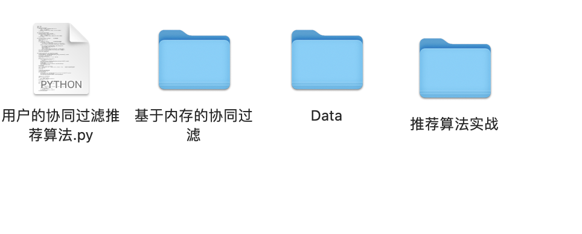
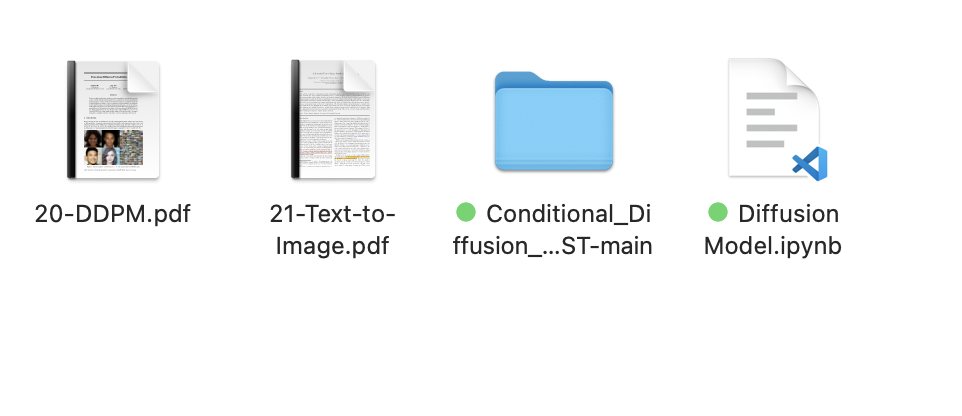
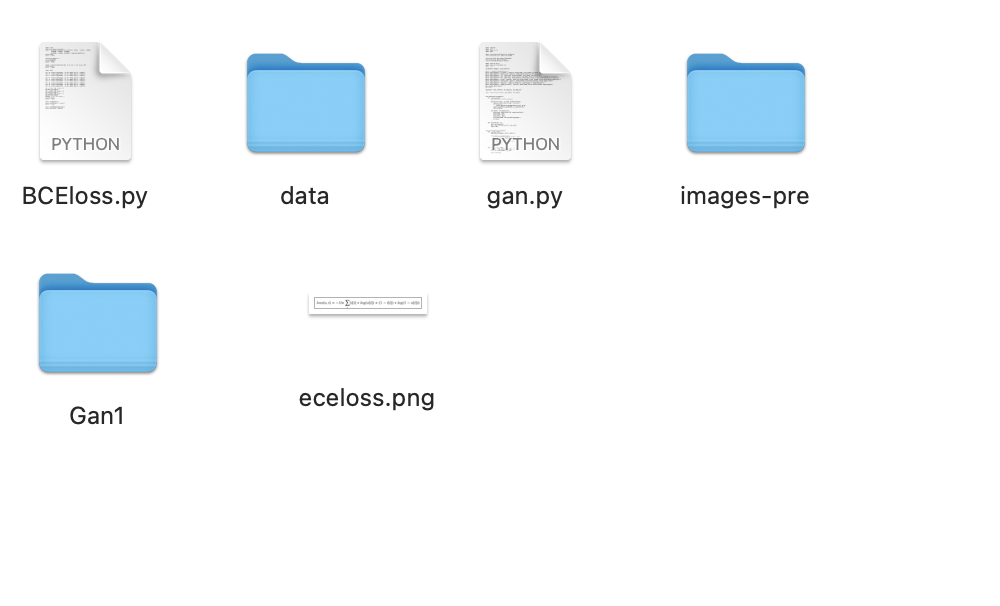
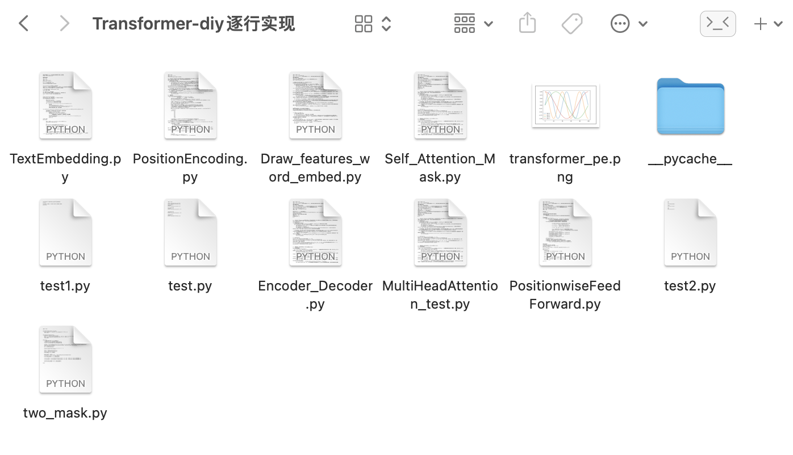

# AI_Learning
***人工智能基础学习记录，包含模型的代码的数据，大部分代码有详细注释***

## 所有文件如下:

### 下载链接（数据较大->夸克网盘）：

| Name                            | link                                          |
| :------------------------------ | :-------------------------------------------- |
| **「计算机视觉」**              | **链接：https://pan.quark.cn/s/210dd7524d49** |
| **「强化学习」**                | **链接：https://pan.quark.cn/s/4836b24c604a** |
| **「因果学习」**                | **链接：https://pan.quark.cn/s/226f1558e9f2** |
| **「chatGPT-学术」**            | **链接：https://pan.quark.cn/s/7d9d5f1691ec** |
| **「提示学习」**                | **链接：https://pan.quark.cn/s/e077b38b90eb** |
| **「自然语言-文本处理」**       | **链接：https://pan.quark.cn/s/633929290c06** |
| **「基础神经网络」**            | **链接：https://pan.quark.cn/s/b7067e6a2f4f** |
| **「图卷积」**                  | **链接：https://pan.quark.cn/s/b644811b68eb** |
| **「元学习」**                  | **链接：https://pan.quark.cn/s/f2453d930f73** |
| **「扩散模型」**                | **链接：https://pan.quark.cn/s/edb5350c6a0a** |
| **「自动驾驶」**                | **链接：https://pan.quark.cn/s/b148649a3300** |
| **「Gan-生成对抗」**            | **链接：https://pan.quark.cn/s/132114b9c621** |
| **「推荐系统」**                | **链接：https://pan.quark.cn/s/1f97668f6175** |
| **「主动学习」**                | **链接：https://pan.quark.cn/s/9fb761250bb0** |
| **「Transformer-diy逐行实现」** | **链接：https://pan.quark.cn/s/10ecfb918ac8** |

### 部分文件内容：

### 计算机视觉

### 自然语言处理

### 强化学习

### 推荐系统

### 扩散模型

### 对抗生成网络

### Transformer diy实现

### 

### 图卷积

